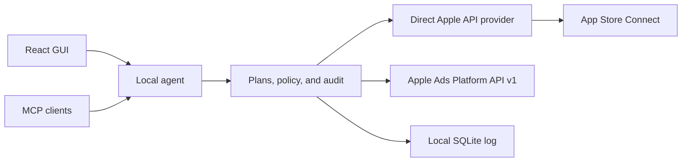

# ASC Studio

ASC Studio is a local-first App Store Connect and Apple Ads control plane with a desktop-grade web interface and an MCP server. It connects straight to Apple's public APIs. It does not install, invoke, or parse another App Store tool.

Complete workflows in this repository include:

- A TestFlight control room for builds, filters, build details, tester groups, and reviewed group assignments.
- A multi-platform Releases workbench for iOS, macOS, tvOS, and visionOS version creation, previous-version carry-forward, build selection, all six localized fields, screenshots, exact-diff review, readiness, review submission, and submission status.
- A guarded App Review path that selects a processed build, previews attachment and submission, checks for stale Apple data, confirms once, and reads the resulting submission state.
- GUI- or environment-managed BYOK writing assistance that translates selected localized copy, adapts selected keywords for local search, and produces grounded customer-review reply drafts. Selected support and marketing URLs are copied locally and never sent to OpenAI.
- An app-scoped written-customer-review inbox with rating, territory, and exact published-response filters; loaded-review search; Apple cursor pagination; a full-review inspector; per-review session drafts; guarded create-or-replace public responses; and optional OpenAI reply drafting.
- A Subscriptions pricing workbench that turns Apple's comparable storefront prices into softened purchasing-power recommendations, enforces a configurable revenue floor, rounds upward to real Apple price points, and schedules only an exact stale-checked territory diff.
- A portfolio-first Analytics workspace that combines every app across all connected App Store Connect accounts, compares periods, ranks the apps behind a change, and preserves the same metric and time context when drilling into territory, source, page type, or version evidence.
- An Apple Ads workspace that combines app suggestions with country-and-genre search popularity, reports on campaign performance, and manages paused-first campaigns, ad groups, keywords, status, budgets, and bids through reviewed plans.

App Store Connect and Apple Ads writes use the same plan, review, stale-check, confirm, and audit path. Writing assistance creates local drafts; it does not write to Apple. The rest of the product map lives in [the roadmap](docs/roadmap.md).


## Why this shape

The product has two entry points but one policy layer:



- Codex can connect to the local MCP endpoint for read-only App Store data. GUI writing assistance is separate and uses your own OpenAI API key.
- [ChatGPT subscriptions and API billing are separate](https://help.openai.com/en/articles/9039756-managing-billing-settings-on-chatgpt-web-and-platform), so ASC Studio does not claim that a ChatGPT or Codex subscription pays for GUI model calls.
- The GUI and MCP server share the same App Store policy. There is no arbitrary `run_asc_command` escape hatch.
- The local agent signs short-lived Apple JWTs. GUI-imported keys pass through the authenticated setup form once, then are stored in macOS Keychain and never returned to the browser. Audit records never contain credentials.
- App Store Connect and Apple Ads can belong to the same Apple organization, but they use separate roles and API credentials. An App Store Connect key is never sent to the Apple Ads API.

See [the local-control-plane record](docs/adr/0001-local-control-plane.md), [the OpenAI credential record](docs/adr/0003-gui-managed-openai-credentials.md), and [the portfolio-analytics ingestion record](docs/adr/0004-portfolio-analytics-ingestion.md) for the full decisions.

## Run it locally with App Store Connect

Requirements:

- Node.js 22.13 or newer
- Xcode Command Line Tools, used to compile and ad-hoc sign the native macOS Keychain helper from source
- macOS with the current user's Keychain available for GUI-managed live credentials
- An App Store Connect team API key: issuer ID, key ID, and the downloaded `.p8` file

```bash
npm install
npm run local
```

Open the `GUI session URL` printed in the terminal. On the first live launch, ASC Studio shows its connection screen:

1. In App Store Connect, open **Users and Access → Integrations**.
2. Create a team API key with the access ASC Studio should have.
3. Copy its issuer ID and key ID.
4. Choose the downloaded `AuthKey_….p8` file and press **Connect securely**.

ASC Studio checks the key with Apple before saving it in macOS Keychain. To add another team, open the Apple account menu at the bottom of the sidebar and choose **Add Apple account**. The same menu switches accounts and removes saved keys. Switching accounts reloads the app list, and any write plan reviewed under another account fails closed.

Each provider has one GUI-managed connection bundle in the current user's default macOS Keychain, normally the login Keychain: App Store Connect, Apple Ads, and OpenAI. Within its data directory, ASC Studio keeps a stable, non-secret random UUID at `<ASC_STUDIO_DATA_DIR>/keychain-vault-id` (`.asc-studio/keychain-vault-id` by default); it namespaces this installation's Keychain items and contains no credential or account metadata. The ID is availability-critical: moving the data directory preserves the association, deleting the ID makes the previous Keychain items undiscoverable to that installation, and copying it to another installation under the same macOS user makes both installations refer to the same Keychain namespace and coordination lock.

To prevent two local agents from racing over the same Keychain vault, ASC Studio keeps a persistent, owner-only SQLite coordination database under the canonical per-user cache lock directory: `~/Library/Caches/ASC Studio/locks` on macOS or `~/.cache/asc-studio/locks` elsewhere. The database is keyed by the vault UUID and contains no credentials. The agent holds a `BEGIN EXCLUSIVE` transaction for its process lifetime; a second process for that vault fails closed, and the operating system releases the transaction lock automatically when the holder exits or crashes.

Keychain mutations also use a vault-wide write-ahead recovery journal. Before each mutation, ASC Studio creates and fsyncs a mode-`0600`, non-secret marker under `~/Library/Application Support/ASC Studio/recovery/`; its filename is keyed only by the stable vault UUID and provider kind. The marker body contains only a fixed recovery-state format version—no credential, connection metadata, or Apple/OpenAI account ID. An exactly verified commit or exactly verified rollback removes the marker and fsyncs the directory. A crash or unverifiable rollback leaves it in place, so the affected provider bundle fails closed in every data-directory copy sharing that vault UUID until the user performs the scoped reset. A successful reset replaces that transient marker with a non-secret, vault-wide reset tombstone. Stale legacy plaintext files found later in another copied data directory are deleted instead of re-imported; an intentional new GUI connection clears the tombstone only after its Keychain write is exactly verified.

Private keys and API keys do not enter the coordination database, application database, audit records, or logs. The setup form briefly holds an imported secret so it can send it to the authenticated loopback agent, but does not put it in browser storage and never receives it back after submission. Generated Apple Ads private keys never enter the browser.

ASC Studio compiles a small native helper from repository source, ad-hoc signs it, and uses Security.framework `SecItem` APIs to access only ASC Studio's fixed service and three vault-scoped provider account IDs. Secret-bearing payloads travel only through the helper's stdin and stdout pipes—never command-line arguments, environment variables, or temporary files. Writes use a bounded length frame, and the helper rejects incomplete or extra payload data before mutating Keychain. Each Keychain item starts with an empty trusted-application list. **Allow Once** permits one helper read. **Always Allow** trusts that helper binary, but any process running as the same macOS user can invoke it, so this is encrypted, OS-mediated storage rather than an app-exclusive boundary. The ad-hoc signature supplies a local code identity for Keychain authorization continuity; it is not a trusted-publisher signature, tamper-resistant boundary, or caller authentication. The source tree and built helper remain owner-writable, so same-user malware remains in the trust boundary. A source or toolchain change can rebuild the helper with a different code identity and cause macOS to prompt again.

After authorization, the agent caches the bundle in process memory for that launch to avoid repeated prompts. Replace and remove evict that cache entry, but JavaScript strings cannot be reliably zeroed and may remain in runtime memory until garbage collection or process exit. Locking Keychain after a bundle is cached does not revoke that in-memory copy; exit ASC Studio to clear the process cache. ASC Studio does not claim a stable signed-host identity, XPC isolation, Data Protection Keychain, Secure Enclave, or guaranteed forensic erasure. A locked, denied, or unavailable Keychain fails closed whenever the agent needs to read it. Environment credentials remain the supported option for unattended or headless operation.

When upgrading from the former file-based credential store, ASC Studio migrates each complete legacy connection bundle to Keychain and removes all associated plaintext metadata and key files only after a successful Keychain write and exact read-back. If migration cannot complete, the legacy files are left untouched for recovery but are not used for provider operations; there is no plaintext fallback.

For unattended local runs, environment credentials override the saved GUI connection:

```bash
ASC_STUDIO_PROFILE_NAME="Personal" \
ASC_STUDIO_ISSUER_ID="ISSUER_ID" \
ASC_STUDIO_KEY_ID="KEY_ID" \
ASC_STUDIO_PRIVATE_KEY_PATH="/absolute/path/to/AuthKey.p8" \
npm run local
```

While environment credentials are active, ASC Studio shows that account as environment-managed and disables adding or removing GUI accounts.

`npm run local` builds the React app and serves it from the loopback-only agent at `http://127.0.0.1:8787`. Stop it with `Ctrl+C`.

### Enable writing assistance

Writing assistance is optional. Open **Connections → Writing assistance**, choose **Connect**, and enter an OpenAI API key and, optionally, a model ID. The same workspace-wide connection powers release translation and review reply drafting for every Apple account in ASC Studio.

The browser holds the key briefly while the form is open and sends it once to the authenticated loopback agent. It never puts the key in browser storage, and the agent never returns it. After the validation below succeeds, the local agent stores the API key and optional model ID together as an encrypted macOS Keychain item. A same-origin script compromise could still capture a key while it is being entered or submitted.

Before saving or replacing a key, ASC Studio makes a small, constant-input OpenAI Responses request against the selected model. The validation request sets `store: false`, contains no App Store content, and may use a small amount of API capacity and billing. It proves only that the key and model worked at that moment. OpenAI's API data policies still govern request processing and retention.

GUI save, replace, and remove actions take effect for subsequent writing requests without restarting ASC Studio. Candidate validation failures happen before the write-ahead marker and leave the current item unchanged. For a Keychain write or verification failure, ASC Studio normally restores and freshly verifies the previous item, then clears the marker durably before reporting failure. A crash or failed rollback verification leaves the marker and final Keychain state uncertain: writing assistance fails closed with `keychain_rollback_failed`, and the GUI offers an explicit OpenAI-only vault reset.

Removing or resetting a connection deletes its Keychain item and matching legacy plaintext credential files in the current data directory, but does not guarantee forensic erasure from Keychain storage or backups, revoke the key at OpenAI, or cancel an OpenAI call already in flight. Revoke a compromised key in the OpenAI platform as well. Recovery resets are deliberately scoped and replace the corresponding recovery marker with a vault-wide reset tombstone: OpenAI reset removes only OpenAI; Apple Ads reset removes every saved Apple Ads connection; App Store Connect reset removes every saved App Store Connect connection and all linked Apple Ads connections. The tombstone prevents a stale copied data directory from silently remigrating legacy credentials; an explicit new connection clears it after verified storage. None of these resets revokes keys at Apple or OpenAI.

For unattended runs, environment configuration remains available as an alternative:

```bash
OPENAI_API_KEY="your-key" npm run local
```

You can choose another supported model:

```bash
OPENAI_API_KEY="your-key" \
ASC_STUDIO_OPENAI_MODEL="gpt-5.6-luna" \
npm run local
```

`OPENAI_API_KEY` overrides a saved GUI key and disables GUI replacement or removal while it is active. `ASC_STUDIO_OPENAI_MODEL` likewise overrides the saved or default model for that process. Environment credentials are not copied into Keychain; they remain subject to the security of the launching process and any referenced files. Environment changes require a restart; GUI-managed changes do not. Removing the environment variables and restarting reveals any previously saved GUI connection again. This follows [OpenAI's API key safety guidance](https://help.openai.com/en/articles/5112595-best-practices-for-api-key-safety). OpenAI API billing remains separate from ChatGPT subscriptions.

**Releases** is the single version-scoped operational workbench. Its platform/version/build context stays shared across **Localized content** and **Screenshots**. Localized content owns What’s New, promotional text, description, keywords, support URL, and marketing URL; Screenshots owns the per-locale, per-device sets. Creating a version copies stable localized content from the selected previous version and leaves What’s New empty by default.

Localized metadata drafts persist per app, version, and locale for the current browser session with exact per-field intent; legacy Store Listing session drafts migrate into Releases. Planning merges only intended fields into fresh App Store Connect state. Screenshot work stays staged across the Releases mode switch, requires explicit discard before leaving, and blocks departure while an apply is running. Readiness and submission remain blocked while any local content or screenshot work is pending. Apple Ads keyword handoff opens **Releases → Localized content → Keywords**. On mobile, a persistent safe-area dock keeps labeled readiness and submit actions available.

To use **Translate & adapt**, choose the source locale, selected content fields, and target locales. Description, What’s New, and promotional text are translated; keywords are adapted for the target locale and search behavior while preserving the comma-list format and 100-character limit. Selected support and marketing URLs are copied unchanged on the device and are never sent to OpenAI. Only selected fields are sent when model work is needed, and only selected fields are applied in an atomic update for each target locale. Review the resulting local drafts through the exact metadata diff and confirmation flow before writing to App Store Connect.

In the Reviews workspace, select a review with a title or body and press **Draft with OpenAI**. The browser sends only the selected app and review IDs to the local agent. The agent re-reads that exact review from the active App Store Connect provider, then makes two live OpenAI Responses calls with `store: false`. The generation call sends only the review's rating, title, and body and accepts only a strict `{responseBody}` result. A separate verification call receives that proposed response and returns a private literal-English safety gloss plus four strict checks: app-side claims, troubleshooting or contact, rating manipulation, and canned or AI-style wording. The local agent discards the gloss and checks; the browser receives only a reply that passes verification. OpenAI's API data policies still govern request processing.

Review text and the proposed reply are treated as untrusted data, not model instructions. The prompt favors brief, specific language over canned support copy or AI filler, and the drafting rules prohibit invented fixes, investigations, causes, plans, versions, timelines, contact channels, refunds, promises, follow-up, and requests to change a rating. A verifier error, invalid output, any flagged category, or uncertainty mapped to a flagged category blocks the draft. This is defense in depth, not a formal proof that a reply is safe. The second call also adds OpenAI latency and API billing to each live draft request.

The result is still a suggestion: review and edit it before pressing **Review response**. That existing action creates the exact, stale-checked plan; only its separate confirmation can write to Apple. If you edit while generation is running, ASC Studio keeps your text and shows the generated reply as a suggestion. An inserted draft can restore the previous local text. Reviews without written feedback do not offer generation.

Open **Subscriptions** to choose an auto-renewable product and one base storefront. ASC Studio normalizes each territory's purchasing-power price level to that storefront. **Careful**, **Balanced**, and **Stronger** close 25%, 50%, or 75% of the resulting gap below Apple's comparable price; relative levels above the base are capped at 100%. The revenue floor is selectable from 60–90% and defaults to 70%. ASC Studio uses a dated World Bank World Development Indicators snapshot (`PA.NUS.PPP ÷ PA.NUS.FCRF`), rounds the guarded factor upward to a five-point band, selects the first real base-storefront Apple price point at or above the target, and uses its exact local-currency equalizations before confirmation.

Missing price-level evidence and missing or currency-mismatched Apple equalizations are not guessed, and a territory with an existing future Apple schedule is not overwritten. Price increases preserve the current subscriber price; decreases do not. Confirmation re-reads the complete current and scheduled price set, fails closed if it changed, and creates only future-dated price resources. Price creates are never retried. After a failed or indeterminate multi-territory write, ASC Studio re-reads Apple, removes schedules attributable to that attempt, and returns the original error only after exact reads verify that the original schedule was restored; otherwise it requires manual App Store Connect review before retrying.

To test the same built local app without touching Apple:

```bash
npm run local:demo
```

### Connect Apple Ads

Apple requires the same sign-in email when you link Apple Ads and App Store Connect, but each service keeps its own roles and API credentials. In ASC Studio, open **Apple services → Manage Apple services**, then choose **Connect Apple Ads**.

ASC Studio can generate the P-256 key pair in the local agent. Copy the public key it shows into **Apple Ads → Account Settings → API**, then enter the client ID, team ID, key ID, and numeric ad-account ID Apple provides. The generated private key remains in local-agent memory while setup is pending, then moves into macOS Keychain after Apple validates the connection; it never enters the browser. You can also import an existing `private-key.pem` file, which passes through the setup form once and is not retained in browser storage.

For unattended local runs, Apple Ads environment credentials override the GUI-managed connection:

```bash
ASC_STUDIO_ADS_PROFILE_NAME="Growth" \
ASC_STUDIO_ADS_CLIENT_ID="SEARCHADS.…" \
ASC_STUDIO_ADS_TEAM_ID="SEARCHADS.…" \
ASC_STUDIO_ADS_KEY_ID="KEY_ID" \
ASC_STUDIO_ADS_AD_ACCOUNT_ID="123456789" \
ASC_STUDIO_ADS_PRIVATE_KEY_PATH="/absolute/path/to/private-key.pem" \
npm run local
```

The local agent signs the OAuth client secret and exchanges it for a one-hour access token. It sends Apple Ads credentials only to `appleid.apple.com` and `api.ads.apple.com`. Environment-managed Apple Ads credentials override GUI-managed Keychain items and are not copied into Keychain. You can use `ASC_STUDIO_ADS_PRIVATE_KEY` instead of the file path, but not both. See Apple's [Apple Ads OAuth guide](https://developer.apple.com/documentation/apple_ads/implementing-oauth-for-the-apple-search-ads-api) and [account-linking guide](https://ads.apple.com/app-store/help/get-started/0012-link-app-store-connect-accounts).

Keyword research combines Apple's app-specific suggestions with weekly or monthly search-term popularity for an exact country and genre. Popularity is relative, not an estimated search count. Apple does not expose keyword difficulty, so ASC Studio does not invent that value.

New campaigns, ad groups, and keywords start paused. The GUI can review campaign name, daily budget, countries, end date, and status changes; create manual-CPT ad groups; add exact or broad keywords; and review keyword bid or status changes. Every confirmation re-reads the Apple Ads object and stops if the account or reviewed state changed.

`npm run dev` and `npm run dev:live` are development commands. They run the Vite server with hot reload. `npm run dev` always uses isolated sample data and cannot fall through to a real connection.

Demo mode uses a deterministic, visibly marked sample writer for translation and review replies. It neither stores an OpenAI key nor calls OpenAI.

Customer-review responses in demo mode likewise stay inside isolated sample data and never reach Apple.

### Enable and sync Analytics

Open **Analytics** to start with **All accounts**, a combined view of every app reachable through every saved App Store Connect account. Switching the operational account does not change this portfolio scope. The first slice shows Impressions, First-time downloads, Total downloads, Product page views, Download rate, Sessions, and Estimated proceeds, with a previous-period comparison. Selecting an app keeps the same range and metric in place, then narrows the ranked evidence to territory, source, page type, or version.

Apple requires an Analytics Reports request for each app. ASC Studio prepares either an ongoing request or a one-time historical snapshot as a normal reviewed mutation plan; it does not create one merely because the Analytics tab was opened. An Admin key is required to create a request. Apple allows Admin, Sales and Reports, or Finance access to download reports after a request exists. The first report instances can take roughly 24–48 hours to appear.

**Sync from Apple** starts a background download and ingestion run; **Refresh view** only re-reads the local report cache. The live provider ingests the Standard daily Discovery and Engagement, Downloads, Pre-Orders, Purchases, and Sessions report families. It fetches every segment, verifies the declared byte size and MD5 checksum, parses changing column order by header name, and publishes a date only after the entire instance succeeds. When Apple produces a correction, the newer processing batch replaces the older partition instead of being added to it. Ongoing and snapshot requests for the same logical report and date are likewise collapsed, with ongoing data preferred when processing dates are equal.

Portfolio totals include only additive values, or ratios recomputed from portfolio-wide additive numerators and denominators. **Total downloads** means first-time downloads plus redownloads; updates are excluded. Impressions combine Apple's raw impression events with product-page views because [Apple defines Impressions as including product-page views](https://developer.apple.com/help/app-store-connect-analytics/reference/metrics-definitions/). **Download rate** is ASC Studio's explicit formula, Total downloads ÷ Product page views; it is not labeled as Apple's Conversion Rate. Sessions can be privacy-limited and usage-opt-in-only. Missing, incomplete, and privacy-withheld values remain unavailable or partial rather than turning into zero. Estimated proceeds come from App Analytics reports and can differ from finalized payments.

Analytics facts, the last discovered nonsecret app roster, and sync state are cached locally in SQLite, scoped by Apple issuer and app. The browser receives opaque source and app identifiers rather than Apple issuer IDs or raw app IDs. A failed or incomplete connected source makes the portfolio explicitly partial; missing data is never converted to zero. Signed report-segment URLs never reach the browser and never receive the App Store Connect authorization token. When deterministic sample-fixture semantics change, Demo mode rebuilds only its demo-issuer analytics cache and seeds it through the same aggregate read model; ordinary launches reuse that versioned cache. Demo performs no Apple network requests, and plans, audit history, reviews, and the live database are untouched.

The one-time bearer secret stays in the URL fragment, moves into browser session storage, and is removed from the address bar after bootstrap. A plain tab without that session cannot call the agent API.

The current live write paths can add a build to a TestFlight group; create an editable iOS, macOS, tvOS, or visionOS App Store version; apply explicitly selected localization fields; add, replace, or delete screenshots for one locale and device set; attach a processed build for the same platform; submit a version to App Review; create or replace a public response to a written customer review; schedule reviewed subscription price points by territory; and create or update the Apple Ads resources listed above. ASC Studio first creates a ten-minute plan, shows the exact before and after state, binds confirmation to that plan and active connection, re-reads Apple data, and stops if anything changed.

## Connect Codex through MCP

Start the local agent, then register its streamable HTTP endpoint:

```bash
export ASC_STUDIO_MCP_TOKEN="paste the MCP bearer token printed at startup"
codex mcp add asc-studio \
  --url http://127.0.0.1:8787/mcp \
  --bearer-token-env-var ASC_STUDIO_MCP_TOKEN
```

The GUI and MCP tokens differ and change on each launch. Start Codex from an environment that contains the current MCP token. An MCP client cannot use its token to call GUI mutation routes.

The MCP server exposes:

- `get_asc_status`
- `get_apple_ads_status`
- `research_apple_ads_keywords`
- `list_apple_ads_campaigns`
- `list_apple_ads_ad_groups`
- `list_apple_ads_keywords`
- `get_apple_ads_campaign_report`
- `plan_apple_ads_campaign_create`
- `plan_apple_ads_campaign_update`
- `plan_apple_ads_ad_group_create`
- `plan_apple_ads_keyword_create`
- `plan_apple_ads_keyword_update`
- `list_apps`
- `list_testflight_builds`
- `list_app_store_versions`
- `list_version_localizations`
- `list_version_screenshots`
- `get_version_submission_status`

Apple Ads plan tools can prepare a local, expiring change plan. They cannot confirm it or write to Apple; the user must inspect the exact diff in the local GUI. The other MCP tools stay read-only. A public ChatGPT plugin will need a stable HTTPS endpoint, user OAuth, and the same core policy; local HTTP is for Codex and development only.

## Commands

```bash
npm run dev        # GUI + isolated demo agent
npm run dev:live   # GUI + direct live Apple API provider
npm run local      # built GUI + direct live Apple API provider
npm run local:demo # built GUI + isolated demo data
npm test           # policy, provider, route, and store tests
npm run typecheck  # all workspaces
npm run build      # production web build
```

## Repository map

```text
apps/
  local-agent/              Loopback API, MCP transport, audit and analytics stores
  web/                      React and Vite interface
packages/
  contracts/                Shared schemas and public data types
  core/                     Provider ports, plans, confirmation, stale checks
  provider-apple-ads/       Direct Apple Ads OAuth and Platform API v1 provider
  provider-app-store-connect/ Direct Apple API client and provider
  provider-demo/            Deterministic isolated provider
docs/
  adr/                      Architecture decisions
  design/                   Accepted concept and verified renders
```

The App Store Connect provider creates ten-minute ES256 JWTs, sends typed JSON:API requests only to Apple's API origin, and follows Apple's signed URLs for asset chunks. The Apple Ads provider creates signed OAuth client secrets and sends typed v1 requests with an exact ad-account scope. Neither provider exposes a generic request runner through the GUI or MCP.

## Current limits

- The direct provider has fixture coverage for authentication, pagination, builds, localization writes, and screenshot uploads. It still needs read-only and guarded-write checks across several real accounts before a stable release.
- Apple Ads writes currently cover paused-first campaign creation, campaign updates, manual-CPT ad-group creation, and keyword creation or updates. Deletes, negative keywords, custom product page ads, audience targeting, recommendations, and shared budgets need separate reviewed slices.
- Build attachment and review submission use Apple's public relationships and review-submission resources. Cancellation, phased release controls, App Review detail editing, and review attachments still need their own slices.
- Writing assistance uses a workspace-wide BYOK OpenAI connection configured in **Connections → Writing assistance** or, for unattended runs, through `OPENAI_API_KEY`. Managed ChatGPT sign-in is not part of this slice.
- Translate & adapt covers selected version-localized description, What’s New, promotional text, keywords, and URLs with the field-specific handling above. Apple Ads research can hand one selected term directly to **Releases → Localized content → Keywords**, but a separate locale-specific keyword-research workflow still remains future work.
- Releases edits version-localized description, promotional text, What’s New, keywords, marketing and support URLs, and screenshots. App-level name, subtitle, and other app-info localizations are not part of this workbench.
- Screenshot upload supports PNG and JPEG files up to 20 MB, validates known device-set dimensions and transparency before planning, and caps each set at ten files. App preview videos need a separate processed-media workflow.
- Upload uses Apple's reserve, signed-chunk upload, commit, process, and reorder flow. Resumable job streams come later.
- Reviews are app-scoped written feedback. The App Store Connect customer-review API does not provide an aggregate overall rating or total rating count, locale or language, platform or app version, or server-side text search. The displayed total is the number of matching written reviews, and search covers only reviews already loaded in the browser.
- Review records have no language field. Reply drafting asks the model to follow the review language only when it is clear and otherwise use English; it does not guarantee language detection or publication-ready copy.
- Apple may take up to 24 hours to publish a new or replaced review response. This slice has no delete-response UI; version-scoped browsing and separately sourced aggregate storefront ratings remain future work.
- Analytics currently uses Standard daily App Analytics report families and manual background sync. It does not yet include non-additive unique-user KPIs, retention or subscription cohorts, peer benchmarks, Sales and Trends reconciliation, finalized financial reports, Apple Ads joins, saved views, scheduled sync, exports, or AI explanations. Apple report latency and privacy processing can make recent dates partial even after a successful sync.
- Subscription parity pricing covers auto-renewable subscription products and future storefront price schedules. It does not yet manage subscription groups, offers, offer codes, introductory pricing, availability, localized subscription metadata, in-app purchases, or StoreKit configuration export. Its World Bank general-price-level evidence is a conservative pricing input, not product-specific demand or willingness-to-pay evidence.
- Per-launch token exchange is manual in development. A packaged desktop shell should inject the GUI secret and manage MCP registration.
- The local agent uses Node's built-in SQLite module, which may still print an experimental warning on some Node releases.
- App creation, privacy-label answers, APNs key creation, and Resolution Center messages do not have complete public App Store Connect API coverage. These need clear web-only adapters, not hidden browser automation.
- This project is not affiliated with Apple.

## Open source

ASC Studio is licensed under the GNU General Public License v3.0 only (`GPL-3.0-only`). Contributions use Developer Certificate of Origin sign-off instead of a CLA. Read [CONTRIBUTING.md](CONTRIBUTING.md) and [SECURITY.md](SECURITY.md) before opening a change.
