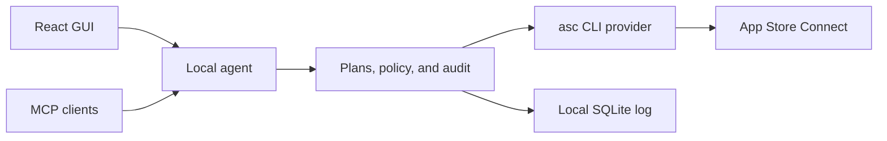

# ASC Studio

ASC Studio is a local-first App Store Connect control plane with a desktop-grade web interface and an MCP server. It uses the open-source `asc` CLI as its first execution provider, so credentials stay in the local `asc` credential store.

This repository now contains five complete vertical slices:

- A TestFlight control room for builds, filters, build details, tester groups, and reviewed group assignments.
- A multi-platform release workspace for iOS, macOS, tvOS, and visionOS version creation, localized What's New, promotional text, keywords, exact diffs, and submission-readiness checks.
- A guarded App Review path that selects a processed build, previews attachment and submission, checks for stale Apple data, confirms once, and reads the resulting submission state.
- BYOK release-copy translation that turns one source locale into checked local drafts for selected locales without reading or changing keywords.
- Per-locale, per-device screenshot sets with local file checks, add or replace modes, exact review plans, stale-data checks, and guarded upload or deletion.

App Store writes use the same plan, review, stale-check, confirm, and audit path. Translation creates local drafts; it does not write to Apple. The rest of the product map lives in [the roadmap](docs/roadmap.md).


## Why this shape

The product has two entry points but one policy layer:



- Codex can connect to the local MCP endpoint for read-only App Store data. The GUI translation flow is separate and uses your own OpenAI API key.
- [ChatGPT subscriptions and API billing are separate](https://help.openai.com/en/articles/9039756-managing-billing-settings-on-chatgpt-web-and-platform), so ASC Studio does not claim that a ChatGPT or Codex subscription pays for GUI model calls.
- The GUI and MCP server share the same App Store policy. There is no arbitrary `run_asc_command` escape hatch.
- `asc` remains the credential owner. ASC Studio stores plans and safe audit summaries, not App Store Connect private keys.

See [the architecture record](docs/adr/0001-local-control-plane.md) for the full decision.

## Run it locally with App Store Connect

Requirements:

- Node.js 22.12 or newer
- [`asc` 1.4.2](https://github.com/rorkai/App-Store-Connect-CLI/releases/tag/1.4.2) for live mode
- An existing `asc` profile for live App Store Connect access

```bash
npm install
brew install asc
asc --version
```

The installed `asc` version must start with `1.4.2`. ASC Studio pins its live JSON contracts to that release and stops on an untested version.

ASC Studio connects through the local `asc` credential store. Create a key in App Store Connect, download its `.p8` file once, then add it to `asc`:

```bash
asc auth login \
  --name "Personal" \
  --key-id "KEY_ID" \
  --issuer-id "ISSUER_ID" \
  --private-key /path/to/AuthKey.p8
asc auth status --validate
```

Start the built GUI and live local agent:

```bash
npm run local
```

Open the `GUI session URL` printed in the terminal. This command builds the React app, serves it from the loopback-only agent at `http://127.0.0.1:8787`, and uses the active local `asc` profile. Stop it with `Ctrl+C`.

When you have more than one account, select a profile before launch or name it for this run:

```bash
asc auth switch --name "Personal"
# or
ASC_STUDIO_PROFILE="Personal" npm run local
```

Live mode fails at startup when `asc` is unavailable or authentication is not ready. Plans and audit events live under `.asc-studio/` by default. ASC credentials stay in the `asc` credential store.

### Enable release-copy translation

Create an OpenAI API key, then pass it to the local agent when you start the built app:

```bash
OPENAI_API_KEY="your-key" npm run local
```

ASC Studio reads the key only in the local agent process. It does not put the key in the browser, database, log, or repository. This follows [OpenAI's API key safety guidance](https://help.openai.com/en/articles/5112595-best-practices-for-api-key-safety). API use has its own billing. You can choose another supported model:

```bash
OPENAI_API_KEY="your-key" \
ASC_STUDIO_OPENAI_MODEL="gpt-5.6-luna" \
npm run local
```

In the release workspace:

1. Edit and save What’s New in the source locale, usually English.
2. Press **Translate**.
3. Pick What’s New, promotional text, or both. Promotional text starts off because it often carries forward unchanged.
4. Pick the target locales and generate translations.
5. Review the local drafts, then use the existing metadata review and confirmation flow to send them to App Store Connect.

Keywords stay outside this action. Each locale keeps its current keyword set until you edit that locale yourself.

To test the same built local app without touching Apple:

```bash
npm run local:demo
```

`npm run dev` and `npm run dev:live` are development commands. They run the Vite server with hot reload. `npm run dev` always uses isolated sample data and cannot fall through to a real profile.

Demo mode also uses a marked sample translator. It does not need an OpenAI key and never calls OpenAI.

The one-time bearer secret stays in the URL fragment, moves into browser session storage, and is removed from the address bar after bootstrap. A plain tab without that session cannot call the agent API.

The current live write paths can add a build to a TestFlight group; create an editable iOS, macOS, tvOS, or visionOS App Store version; apply selected locale changes; add, replace, or delete screenshots for one locale and device set; attach a processed build for the same platform; and submit a version to App Review. ASC Studio first creates a ten-minute plan, shows the exact before and after state, binds confirmation to that plan and active profile, re-reads Apple data, and stops if anything changed.

## Connect Codex through MCP

Start the local agent, then register its streamable HTTP endpoint:

```bash
export ASC_STUDIO_MCP_TOKEN="paste the MCP bearer token printed at startup"
codex mcp add asc-studio \
  --url http://127.0.0.1:8787/mcp \
  --bearer-token-env-var ASC_STUDIO_MCP_TOKEN
```

The GUI and MCP tokens differ and change on each launch. Start Codex from an environment that contains the current MCP token. An MCP client cannot use its token to call GUI mutation routes.

The MCP server exposes:

- `get_asc_status`
- `list_apps`
- `list_testflight_builds`
- `list_app_store_versions`
- `list_version_localizations`
- `list_version_screenshots`
- `get_version_submission_status`

MCP stays read-only for now. Consequential actions go through the local GUI review screen. A public ChatGPT plugin will need a stable HTTPS endpoint, user OAuth, and the same core policy; local HTTP is for Codex and development only.

## Commands

```bash
npm run dev        # GUI + isolated demo agent
npm run dev:live   # GUI + the active local asc profile
npm run local      # built GUI + live local asc profile
npm run local:demo # built GUI + isolated demo data
npm test           # policy, provider, route, and store tests
npm run typecheck  # all workspaces
npm run build      # production web build
```

## Repository map

```text
apps/
  local-agent/              Loopback API, MCP transport, SQLite audit store
  web/                      React and Vite interface
packages/
  contracts/                Shared schemas and public data types
  core/                     Provider ports, plans, confirmation, stale checks
  provider-asc-cli/         Allowlisted argv and demo/live providers
docs/
  adr/                      Architecture decisions
  design/                   Accepted concept and verified renders
```

The provider invokes `asc` with an argument array and `shell: false`. It validates IDs before mutations and never exposes arbitrary commands or file paths.

## Current limits

- Live JSON parsing is pinned to exact, fixture-tested `asc` 1.4.2 response shapes and fails closed on unknown output. It still needs read-only checks across several real accounts before a stable release.
- Build attachment and submission use the combined, guarded `asc review submit` flow. Cancellation, phased release controls, App Review detail editing, and review attachments still need their own slices.
- Translation currently uses BYOK through `OPENAI_API_KEY`; managed ChatGPT sign-in is not part of this slice.
- The translation action covers What’s New and promotional text. Locale keyword research and suggestions need their own workflow and never reuse translation output.
- Long descriptions stay unchanged when metadata is copied. A full Store Listing editor comes after the frequent update fields.
- Screenshot upload supports PNG and JPEG files up to 20 MB, validates known device-set dimensions and transparency before planning, and caps each set at ten files. App preview videos need a separate processed-media workflow.
- Upload uses a safe staged-file handoff to `asc`. A packaged desktop file picker and resumable job stream come later.
- Per-launch token exchange is manual in development. A packaged desktop shell should inject the GUI secret and manage MCP registration.
- The local agent uses Node's built-in SQLite module, which may still print an experimental warning on some Node releases.
- App creation, privacy-label answers, APNs key creation, and Resolution Center messages do not have complete public App Store Connect API coverage. These need clear web-only adapters, not hidden browser automation.
- This project is not affiliated with Apple.

## Open source

ASC Studio uses the Apache-2.0 license for its explicit patent grant. Contributions use Developer Certificate of Origin sign-off instead of a CLA. Read [CONTRIBUTING.md](CONTRIBUTING.md) and [SECURITY.md](SECURITY.md) before opening a change.
