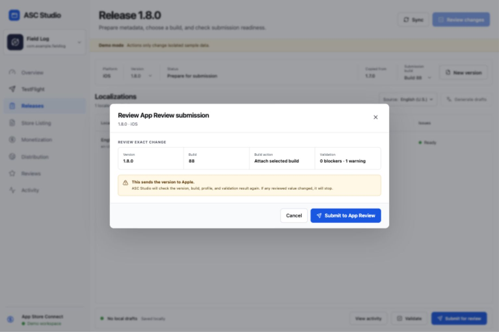
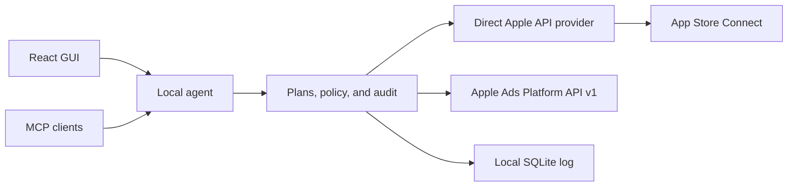

# ASC Studio

ASC Studio is a local-first App Store Connect and Apple Ads control plane with a desktop-grade web interface and an MCP server. It connects straight to Apple's public APIs. It does not install, invoke, or parse another App Store tool.

This repository now contains six complete vertical slices:

- A TestFlight control room for builds, filters, build details, tester groups, and reviewed group assignments.
- A multi-platform release workspace for iOS, macOS, tvOS, and visionOS version creation, localized What's New, promotional text, keywords, exact diffs, and submission-readiness checks.
- A guarded App Review path that selects a processed build, previews attachment and submission, checks for stale Apple data, confirms once, and reads the resulting submission state.
- BYOK release-copy translation that turns one source locale into checked local drafts for selected locales without reading or changing keywords.
- Per-locale, per-device screenshot sets with local file checks, add or replace modes, exact review plans, stale-data checks, and guarded upload or deletion.
- An Apple Ads workspace that combines app suggestions with country-and-genre search popularity, reports on campaign performance, and manages paused-first campaigns, ad groups, keywords, status, budgets, and bids through reviewed plans.

App Store Connect and Apple Ads writes use the same plan, review, stale-check, confirm, and audit path. Translation creates local drafts; it does not write to Apple. The rest of the product map lives in [the roadmap](docs/roadmap.md).



## Why this shape

The product has two entry points but one policy layer:



- Codex can connect to the local MCP endpoint for read-only App Store data. The GUI translation flow is separate and uses your own OpenAI API key.
- [ChatGPT subscriptions and API billing are separate](https://help.openai.com/en/articles/9039756-managing-billing-settings-on-chatgpt-web-and-platform), so ASC Studio does not claim that a ChatGPT or Codex subscription pays for GUI model calls.
- The GUI and MCP server share the same App Store policy. There is no arbitrary `run_asc_command` escape hatch.
- The local agent signs short-lived Apple JWTs. The browser never receives a saved private key, and audit records never contain credentials.
- App Store Connect and Apple Ads can belong to the same Apple organization, but they use separate roles and API credentials. An App Store Connect key is never sent to the Apple Ads API.

See [the architecture record](docs/adr/0001-local-control-plane.md) for the full decision.

## Run it locally with App Store Connect

Requirements:

- Node.js 22.12 or newer
- An App Store Connect team API key: issuer ID, key ID, and the downloaded `.p8` file

```bash
npm install
npm run local
```

Open the `GUI session URL` printed in the terminal. On the first live launch, ASC Studio shows its connection screen:

1. In App Store Connect, open **Users and Access → Integrations**.
2. Create a team API key with the access ASC Studio should have.
3. Copy its issuer ID and key ID.
4. Choose the downloaded `AuthKey_….p8` file and press **Connect securely**.

ASC Studio checks the key with Apple before saving it. To add another team, open the Apple account menu at the bottom of the sidebar and choose **Add Apple account**. The same menu switches accounts and removes saved keys. Switching accounts reloads the app list, and any write plan reviewed under another account fails closed.

Saved keys and their small metadata file live under `.asc-studio/credentials/` with owner-only permissions. Plans and audit events live in SQLite under `.asc-studio/`; neither the database nor logs contain private keys. Saved accounts remain available on later launches.

For unattended local runs, environment credentials override the saved GUI connection:

```bash
ASC_STUDIO_PROFILE_NAME="Personal" \
ASC_STUDIO_ISSUER_ID="ISSUER_ID" \
ASC_STUDIO_KEY_ID="KEY_ID" \
ASC_STUDIO_PRIVATE_KEY_PATH="/absolute/path/to/AuthKey.p8" \
npm run local
```

While environment credentials are active, ASC Studio shows that account as environment-managed and disables adding or removing GUI accounts.

`npm run local` builds the React app and serves it from the loopback-only agent at `http://127.0.0.1:8787`. Stop it with `Ctrl+C`.

### Enable release-copy translation

Create an OpenAI API key, then pass it to the local agent when you start the built app:

```bash
OPENAI_API_KEY="your-key" npm run local
```

ASC Studio reads the key only in the local agent process. It does not put the key in the browser, database, log, or repository. This follows [OpenAI's API key safety guidance](https://help.openai.com/en/articles/5112595-best-practices-for-api-key-safety). API use has its own billing. You can choose another supported model:

```bash
OPENAI_API_KEY="your-key" \
ASC_STUDIO_OPENAI_MODEL="gpt-5.6-luna" \
npm run local
```

In the release workspace:

1. Edit and save What’s New in the source locale, usually English.
2. Press **Translate**.
3. Pick What’s New, promotional text, or both. Promotional text starts off because it often carries forward unchanged.
4. Pick the target locales and generate translations.
5. Review the local drafts, then use the existing metadata review and confirmation flow to send them to App Store Connect.

Keywords stay outside this action. Each locale keeps its current keyword set until you edit that locale yourself.

To test the same built local app without touching Apple:

```bash
npm run local:demo
```

### Connect Apple Ads

Apple requires the same sign-in email when you link Apple Ads and App Store Connect, but each service keeps its own roles and API credentials. In ASC Studio, open **Apple services → Manage Apple services**, then choose **Connect Apple Ads**.

ASC Studio can generate the P-256 key pair in the local agent. Copy the public key it shows into **Apple Ads → Account Settings → API**, then enter the client ID, team ID, key ID, and numeric ad-account ID Apple provides. The generated private key never enters the browser. You can also import an existing `private-key.pem` file.

For unattended local runs, Apple Ads environment credentials override the GUI-managed connection:

```bash
ASC_STUDIO_ADS_PROFILE_NAME="Growth" \
ASC_STUDIO_ADS_CLIENT_ID="SEARCHADS.…" \
ASC_STUDIO_ADS_TEAM_ID="SEARCHADS.…" \
ASC_STUDIO_ADS_KEY_ID="KEY_ID" \
ASC_STUDIO_ADS_AD_ACCOUNT_ID="123456789" \
ASC_STUDIO_ADS_PRIVATE_KEY_PATH="/absolute/path/to/private-key.pem" \
npm run local
```

The local agent signs the OAuth client secret and exchanges it for a one-hour access token. It sends Apple Ads credentials only to `appleid.apple.com` and `api.ads.apple.com`. You can use `ASC_STUDIO_ADS_PRIVATE_KEY` instead of the file path, but not both. See Apple's [Apple Ads OAuth guide](https://developer.apple.com/documentation/apple_ads/implementing-oauth-for-the-apple-search-ads-api) and [account-linking guide](https://ads.apple.com/app-store/help/get-started/0012-link-app-store-connect-accounts).

Keyword research combines Apple's app-specific suggestions with weekly or monthly search-term popularity for an exact country and genre. Popularity is relative, not an estimated search count. Apple does not expose keyword difficulty, so ASC Studio does not invent that value.

New campaigns, ad groups, and keywords start paused. The GUI can review campaign name, daily budget, countries, end date, and status changes; create manual-CPT ad groups; add exact or broad keywords; and review keyword bid or status changes. Every confirmation re-reads the Apple Ads object and stops if the account or reviewed state changed.

`npm run dev` and `npm run dev:live` are development commands. They run the Vite server with hot reload. `npm run dev` always uses isolated sample data and cannot fall through to a real connection.

Demo mode also uses a marked sample translator. It does not need an OpenAI key and never calls OpenAI.

The one-time bearer secret stays in the URL fragment, moves into browser session storage, and is removed from the address bar after bootstrap. A plain tab without that session cannot call the agent API.

The current live write paths can add a build to a TestFlight group; create an editable iOS, macOS, tvOS, or visionOS App Store version; apply selected locale changes; add, replace, or delete screenshots for one locale and device set; attach a processed build for the same platform; submit a version to App Review; and create or update the Apple Ads resources listed above. ASC Studio first creates a ten-minute plan, shows the exact before and after state, binds confirmation to that plan and active connection, re-reads Apple data, and stops if anything changed.

## Connect Codex through MCP

Start the local agent, then register its streamable HTTP endpoint:

```bash
export ASC_STUDIO_MCP_TOKEN="paste the MCP bearer token printed at startup"
codex mcp add asc-studio \
  --url http://127.0.0.1:8787/mcp \
  --bearer-token-env-var ASC_STUDIO_MCP_TOKEN
```

The GUI and MCP tokens differ and change on each launch. Start Codex from an environment that contains the current MCP token. An MCP client cannot use its token to call GUI mutation routes.

The MCP server exposes:

- `get_asc_status`
- `get_apple_ads_status`
- `research_apple_ads_keywords`
- `list_apple_ads_campaigns`
- `list_apple_ads_ad_groups`
- `list_apple_ads_keywords`
- `get_apple_ads_campaign_report`
- `plan_apple_ads_campaign_create`
- `plan_apple_ads_campaign_update`
- `plan_apple_ads_ad_group_create`
- `plan_apple_ads_keyword_create`
- `plan_apple_ads_keyword_update`
- `list_apps`
- `list_testflight_builds`
- `list_app_store_versions`
- `list_version_localizations`
- `list_version_screenshots`
- `get_version_submission_status`

Apple Ads plan tools can prepare a local, expiring change plan. They cannot confirm it or write to Apple; the user must inspect the exact diff in the local GUI. The other MCP tools stay read-only. A public ChatGPT plugin will need a stable HTTPS endpoint, user OAuth, and the same core policy; local HTTP is for Codex and development only.

## Commands

```bash
npm run dev        # GUI + isolated demo agent
npm run dev:live   # GUI + direct live Apple API provider
npm run local      # built GUI + direct live Apple API provider
npm run local:demo # built GUI + isolated demo data
npm test           # policy, provider, route, and store tests
npm run typecheck  # all workspaces
npm run build      # production web build
```

## Repository map

```text
apps/
  local-agent/              Loopback API, MCP transport, SQLite audit store
  web/                      React and Vite interface
packages/
  contracts/                Shared schemas and public data types
  core/                     Provider ports, plans, confirmation, stale checks
  provider-apple-ads/       Direct Apple Ads OAuth and Platform API v1 provider
  provider-app-store-connect/ Direct Apple API client and provider
  provider-demo/            Deterministic isolated provider
docs/
  adr/                      Architecture decisions
  design/                   Accepted concept and verified renders
```

The App Store Connect provider creates ten-minute ES256 JWTs, sends typed JSON:API requests only to Apple's API origin, and follows Apple's signed URLs for asset chunks. The Apple Ads provider creates signed OAuth client secrets and sends typed v1 requests with an exact ad-account scope. Neither provider exposes a generic request runner through the GUI or MCP.

## Current limits

- The direct provider has fixture coverage for authentication, pagination, builds, localization writes, and screenshot uploads. It still needs read-only and guarded-write checks across several real accounts before a stable release.
- Apple Ads writes currently cover paused-first campaign creation, campaign updates, manual-CPT ad-group creation, and keyword creation or updates. Deletes, negative keywords, custom product page ads, audience targeting, recommendations, and shared budgets need separate reviewed slices.
- Build attachment and review submission use Apple's public relationships and review-submission resources. Cancellation, phased release controls, App Review detail editing, and review attachments still need their own slices.
- Translation currently uses BYOK through `OPENAI_API_KEY`; managed ChatGPT sign-in is not part of this slice.
- The translation action covers What’s New and promotional text. Apple Ads research can hand one selected term to the active locale draft, but full locale-by-locale keyword research still needs its own workflow.
- Long descriptions stay unchanged when metadata is copied. A full Store Listing editor comes after the frequent update fields.
- Screenshot upload supports PNG and JPEG files up to 20 MB, validates known device-set dimensions and transparency before planning, and caps each set at ten files. App preview videos need a separate processed-media workflow.
- Upload uses Apple's reserve, signed-chunk upload, commit, process, and reorder flow. Resumable job streams come later.
- Per-launch token exchange is manual in development. A packaged desktop shell should inject the GUI secret and manage MCP registration.
- The local agent uses Node's built-in SQLite module, which may still print an experimental warning on some Node releases.
- App creation, privacy-label answers, APNs key creation, and Resolution Center messages do not have complete public App Store Connect API coverage. These need clear web-only adapters, not hidden browser automation.
- This project is not affiliated with Apple.

## Open source

ASC Studio is licensed under the GNU General Public License v3.0 only (`GPL-3.0-only`). Contributions use Developer Certificate of Origin sign-off instead of a CLA. Read [CONTRIBUTING.md](CONTRIBUTING.md) and [SECURITY.md](SECURITY.md) before opening a change.
